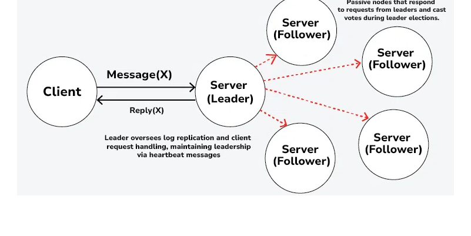
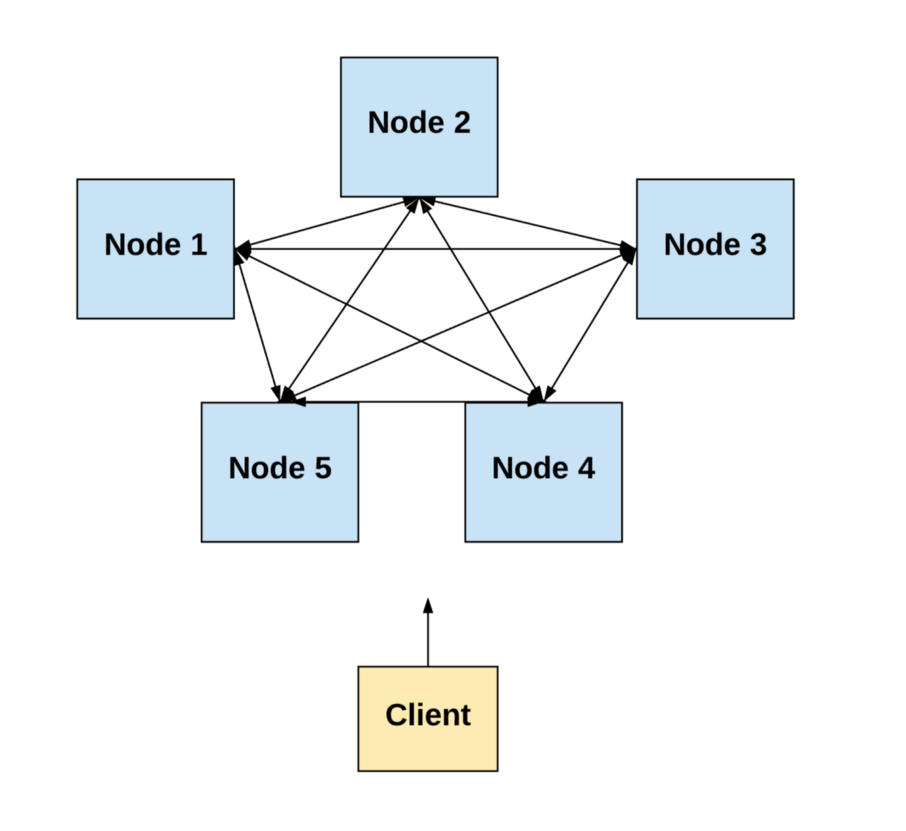

# DistributedServicesGo
Distributed Scalable Services with Go

Ex00 - 01 key-hash-based balancing so client could explicitly calculate for every entry the list of nodes where it should be stored according to a replication factor.

Ex02  introduce concepts of a Leader and a Follower nodes. Client ONLY interacts with a Leader node. The hashing function to determine where to write replicas is now on Leader, not in client.




```
~$ ./warehouse-cli -H 127.0.0.1 -P 8765
Connected to a database of Warehouse 13 at 127.0.0.1:8765
Known nodes:
127.0.0.1:8765
127.0.0.1:9876
127.0.0.1:8697
> SET 12345 '{"name": "Chapayev's Mustache comb"}'
Error: Key is not a proper UUID4
> SET 0d5d3807-5fbf-4228-a657-5a091c4e497f '{"name": "Chapayev's Mustache comb"}'
Created (2 replicas)
> GET 0d5d3807-5fbf-4228-a657-5a091c4e497f
'{"name": "Chapayev's Mustache comb"}'
> DELETE 0d5d3807-5fbf-4228-a657-5a091c4e497f
Deleted (2 replicas)
> GET 0d5d3807-5fbf-4228-a657-5a091c4e497f
Not found
>
# if current instance is stopped in the background
Reconnected to a database of Warehouse 13 at 127.0.0.1:8697
Known nodes:
127.0.0.1:9876
127.0.0.1:8697
> 
# if another current instance is stopped in the background
Reconnected to a database of Warehouse 13 at 127.0.0.1:9876
Known nodes:
127.0.0.1:9876
WARNING: cluster size (1) is smaller than a replication factor (2)!
>
```

